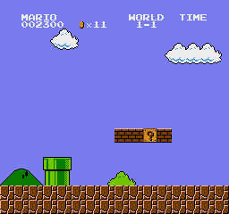

# NeSLE

**GPU-native NES emulation for reinforcement learning.**

NeSLE emulates the NES entirely inside a CUDA kernel: 6502 CPU, PPU, bus, and
OAM DMA run one thread per environment, stepping thousands of independent
consoles in a single kernel launch. Observations stay resident on the device,
so training never round-trips through host memory. Includes an
SB3-compatible vectorized environment, a GPU-resident PPO implementation, and
Super Mario Bros. reward and RAM parsing.

[](https://github.com/hbofz/NeSLE/actions/workflows/ci.yml)
[](LICENSE)
[](https://www.python.org/downloads/)
[](https://colab.research.google.com/github/hbofz/NeSLE/blob/main/notebooks/verify_claims.ipynb)



## Features

- **Batched emulation in a single kernel.** One CUDA thread runs one complete
  NROM console. Frame-skip is applied inside the kernel, so a batch step is one
  launch regardless of frameskip.
- **Device-resident observations.** RGB frames and RAM can be consumed without
  a host copy. `step_reward` skips rendering entirely for training loops that
  only need rewards and done flags.
- **GPU-resident PPO.** `nesle.native_ppo` keeps rollouts, GAE, and the
  optimizer on device, exchanging tensors with PyTorch through DLPack and
  `__cuda_array_interface__` rather than an SB3 CPU rollout buffer.
- **Stable-Baselines3 compatible.** `NesleVecEnv` implements the SB3 `VecEnv`
  contract, including auto-reset, and drops into existing SB3 training code.
- **Snapshot reset.** Bundled FCEUX save states for all eight worlds place every
  environment directly into gameplay. Auto-reset on done restores the snapshot
  in one kernel launch. Multiple snapshots are round-robin assigned across
  environments for curriculum training.
- **On-device reward shaping.** Dense progress, checkpoint, and death rewards
  are computed on the GPU with per-component CLI overrides.
- **Curated action spaces.** `right_only`, `simple`, `complex`, and `mario`
  (11 actions), with raw controller bitmask support.
- **Reference CPU backend.** A single-environment C++ console for debugging and
  parity testing against the batched kernel.

## Performance

Environment steps per second, frameskip 4 (one env-step is four NES frames):

| Device | Envs | Env-steps/s | NES frames/s |
|---|---:|---:|---:|
| GTX 1050 Ti (4 GB) | 4,096 | 180,437 | 721,748 |
| A100 40 GB | 4,096 | 310,903 | 1,243,610 |
| A100 40 GB | 16,384 | 1,108,937 | 4,435,748 |
| A100 40 GB | 32,768 | 2,004,806 | 8,019,223 |
| A100 40 GB | 65,536 | **3,267,050** | **13,068,201** |
| A100 40 GB | 131,072 | 3,055,618 | past the saturation knee |

Peak is about 13.1M NES frames/s, roughly 218,000x real time. At one
environment the GPU loses to a single-environment CPU emulator (0.4x), because
per-step launch overhead dominates; it overtakes the CPU baseline by 8
environments and then scales almost exactly linearly through 4,096, holding to
around 8,192 before the curve softens.

Device memory runs about **195 KB per environment**: the 65,536-env peak
occupies 12.2 GiB, measured with the batch resident. Capacity is not the
constraint; throughput saturates first, just past 65,536.

For reference, `nes-py` / `gym-super-mario-bros`, the standard CPU stack for
this benchmark, measures 132 env-steps/s on the 1050 Ti host. The 4,096-env GPU
configuration on that same machine is roughly **1,370x** that baseline.

These figures were re-measured on 2026-09-01 from a clean clone with all 69
tests passing and all three falsifiability checks green. Two independent runs,
on a 40 GB and an 80 GB A100, agreed to within 0.2% and reproduced every
previously published value at or above its claim. Raw output:
[docs/data/verification-2026-09-01-a100.json](docs/data/verification-2026-09-01-a100.json).
Reproduce it yourself with `benchmarks/verify_claims.py` (see below).

**Methodology note.** The `nes-py` baseline is single-process and is not a
fully loaded multi-core CPU. Measuring it under `SubprocVecEnv` across all
cores is a [tracked task](#roadmap). At training scale the PPO learner rather
than the emulator is the bottleneck, which is the intended outcome.

Reproduce with `python benchmarks/gpu_vs_cpu.py` (about three minutes).
Full method, per-device tables, and measurement history:
[docs/benchmark-gpu-vs-cpu.md](docs/benchmark-gpu-vs-cpu.md).

## Installation

Requires Python 3.10 or newer, a CUDA GPU, CUDA Toolkit 12.x, and a C++20
toolchain.

```sh
git clone https://github.com/hbofz/NeSLE.git
cd NeSLE
python -m venv .venv && . .venv/bin/activate
python -m pip install -e '.[dev,rl]'

# The rl extra installs CPU-only torch. --force-reinstall is required: the CUDA
# wheel carries the same version number, so pip otherwise keeps the CPU build.
python -m pip install --force-reinstall torch --index-url https://download.pytorch.org/whl/cu126

python scripts/build_cuda_extension.py
```

Windows, CUDA architecture overrides, Docker, and toolchain troubleshooting:
[docs/install.md](docs/install.md).

NeSLE does not distribute ROMs. Supply a legally obtained Super Mario Bros.
ROM in iNES format (mapper 0).

## Usage

### Vectorized environment

```python
import nesle

envs = nesle.make_vec(
    "Super Mario Bros. (World).nes",
    num_envs=2048,
    backend="cuda",
    observation_mode="ram",
    action_space="mario",
    reset_state_path="docs/data/smb_level1_1.state",
)

obs = envs.reset()
for _ in range(128):
    actions = [envs.action_space.sample() for _ in range(envs.num_envs)]
    obs, rewards, dones, infos = envs.step(actions)
```

`envs.step_reward(actions)` returns rewards, dones, and infos without
rendering or copying frames, which is the path used by the native PPO loop.

Pass `reset_state_paths=[...]` with several snapshots to distribute
environments across worlds for curriculum training.

### Single environment

```python
env = nesle.make("Super Mario Bros. (World).nes", action_space="simple")
obs, info = env.reset()
obs, reward, terminated, truncated, info = env.step(env.action_space.sample())
```

### Training

GPU-resident PPO:

```sh
python examples/native_ppo_train.py "Super Mario Bros. (World).nes" \
    --reset-state-path docs/data/smb_level1_1.state \
    --action-space mario --reward-mode smart \
    --num-envs 2048 --total-timesteps 25_000_000 \
    --n-steps 128 --batch-size 8192 \
    --checkpoint-path checkpoints/native_ppo.pt
```

Stable-Baselines3:

```sh
python examples/sb3_train.py "Super Mario Bros. (World).nes" \
    --backend cuda --sb3-device cpu \
    --observation-mode ram --action-space simple \
    --reset-state-path docs/data/smb_level1_1.state \
    --num-envs 8 --timesteps 16384 --model-path nesle_ppo_smoke
```

### Evaluation

```sh
python examples/native_ppo_eval.py "Super Mario Bros. (World).nes" \
    --checkpoint checkpoints/native_ppo.pt --gif-out agent.gif
```

The recording above is a 25M-timestep run at 2,048 environments, roughly 2.5
hours on a GTX 1050 Ti. Episode return improved from -26 to approximately 195
with explained variance rising from 0 to 0.88. The World 1-1 clear is the tail
of the distribution; typical episodes terminate near x=1,100.

Full flag reference and troubleshooting: [docs/training.md](docs/training.md).

## Testing and validation

```sh
python -m pytest tests/                   # 69 tests; GPU and ROM tests auto-skip when absent
python benchmarks/verify_correctness.py   # asserts the batch is N independent emulators
```

Every performance figure in this README can be re-measured from a clean clone.
`benchmarks/verify_claims.py` reuses the functions in `benchmarks/gpu_vs_cpu.py`
so the protocol matches the published tables, then prints a claimed-vs-measured
pass/fail table and writes a JSON artifact. It exits non-zero if any claim,
test, or falsifiability check fails.

On a GPU machine:

```sh
python benchmarks/verify_claims.py --repo . --rom "Super Mario Bros. (World).nes"
```

On a rented A100 from your terminal, via the
[Colab CLI](https://github.com/googlecolab/google-colab-cli):

```sh
pip install google-colab-cli
colab new -s nesle --gpu A100
colab upload -s nesle "Super Mario Bros. (World).nes" /content/rom.nes
colab exec   -s nesle -f benchmarks/verify_claims.py
colab download -s nesle /content/verification.json ./docs/data/
colab stop -s nesle
```

Or in a browser with
[`notebooks/verify_claims.ipynb`](notebooks/verify_claims.ipynb)
([one click](https://colab.research.google.com/github/hbofz/NeSLE/blob/main/notebooks/verify_claims.ipynb)),
which is a thin wrapper over the same script.

The 6502 core is gated on the Klaus functional test suite
([docs/cpu-validation.md](docs/cpu-validation.md)). The table-driven decoder was
validated against the previous interpreter across 8M random instructions with
zero divergence in results, bus traffic, or cycle counts. C++ unit tests in
`tests/cpp/` are currently built ad hoc by `scripts/run_cpp_tests.sh`.

## Limitations

- **Mapper 0 (NROM) only.** Super Mario Bros. works. Other mappers are not
  implemented.
- **Renderer artifacts in recordings.** The PPU samples presentation state at
  vblank with a sprite-0 scroll split, which removed 84% of observed artifacts,
  but roughly 14% of frames during heavy action still drop the status bar for a
  single frame. Game state and RAM-based training are unaffected.
- **Title screen transition.** The menu-to-gameplay state machine stalls on a
  PPU timing bug. Snapshot reset bypasses it completely.
- **Windows training ceiling.** Under the WDDM driver model, interleaving torch
  CUDA kernels with emulator launches caps native PPO near 3,000 env-steps/s at
  2,048 environments. Linux is unaffected.
- **One thread per environment.** Warp divergence leaves throughput unclaimed at
  large batch sizes.

Detail and reproduction steps for each: [KNOWN_ISSUES.md](KNOWN_ISSUES.md).

## Roadmap

Open work, roughly in increasing order of difficulty. Every row is a filed
issue, so pick one and comment on it.

| Issue | Task | Entry point |
|---|---|---|
| [#3](https://github.com/hbofz/NeSLE/issues/3) | Multi-core CPU baseline, so the speedup is measured against a loaded CPU rather than one core | `benchmarks/nespy_baseline.py` |
| [#2](https://github.com/hbofz/NeSLE/issues/2) | Run the C++ tests on Windows and surface them through pytest (Ubuntu-only today) | `.github/workflows/ci.yml` |
| [#5](https://github.com/hbofz/NeSLE/issues/5) | Regenerate the 1050 Ti benchmark table, which predates the optimization program | `benchmarks/gpu_vs_cpu.py` |
| [#4](https://github.com/hbofz/NeSLE/issues/4) | Fold the CUDA extension build into `setup.py`, so one `pip install -e .` is enough | `scripts/build_cuda_extension.py` |
| [#9](https://github.com/hbofz/NeSLE/issues/9) | State-correlation scheduling: levels are assigned round-robin, so a 32-lane warp spans every world at once | `src/nesle/env.py:412` |
| [#7](https://github.com/hbofz/NeSLE/issues/7) | Renderer lag frames still drop the status bar on ~14% of heavy-action frames | `cpp/include/nesle/cuda/batch_render.cuh` |
| [#10](https://github.com/hbofz/NeSLE/issues/10) | Windows WDDM caps native PPO at ~3k env-steps/s; Linux is unaffected | `benchmarks/profile_native_ppo.py` |
| [#8](https://github.com/hbofz/NeSLE/issues/8) | Title screen to gameplay transition stalls on PPU timing (bypassed by snapshot reset) | `cpp/include/nesle/cuda/batch_ppu.cuh` |
| [#6](https://github.com/hbofz/NeSLE/issues/6) | **Mapper support (MMC1, MMC3).** The big one: takes NeSLE from a Mario trainer to a general NES RL platform | `cpp/include/nesle/cuda/batch_bus.cuh` |

## Contributing

Issues and pull requests are welcome. See
[CONTRIBUTING.md](CONTRIBUTING.md) for setup, the checks to run, and the bar for
emulator and performance changes (kernel work needs before/after numbers from
`benchmarks/gpu_vs_cpu.py`).

[docs/gpu-scaling.md](docs/gpu-scaling.md) documents the optimization program
including the rejected approaches and the measurements that ruled them out
(zero page in shared memory: 1.9x regression from occupancy collapse on sm_61;
opcode-binned wavefront dispatch: 3.2x slower than thread-per-environment on
decorrelated instruction streams). Read it before proposing kernel redesigns.

## Documentation

| Document | Contents |
|---|---|
| [Training](docs/training.md) | Practical training guide, all flags |
| [Installation](docs/install.md) | Platform-specific build instructions |
| [Architecture](docs/architecture.md) | System design |
| [Design rationale](docs/design.md) | Why the emulator lives inside the kernel |
| [GPU scaling](docs/gpu-scaling.md) | Optimization program, rejected approaches, open roadmap |
| [Benchmarks](docs/benchmark-gpu-vs-cpu.md) | GPU vs CPU method and history |
| [A100 report](docs/phase6-report.md) | Archived May 2026 observation-mode ablations (1 to 128 envs) |
| [CPU validation](docs/cpu-validation.md) | Klaus 6502 functional test gate |
| [Headless runner](docs/headless-runner.md) | Low-level ROM runner for debugging |
| [Known issues](KNOWN_ISSUES.md) | Current defects and deferred work |

## Repository layout

```text
cpp/            C++/CUDA emulator core (headers, kernels, pybind11 bindings)
src/nesle/      Python package: env, actions, rewards, ROM parsing, native PPO
tests/          Python test suite, plus C++ tests in tests/cpp/
examples/       Training and evaluation entry points
benchmarks/     Throughput and correctness benchmarks
scripts/        Build and verification scripts
docs/           Guides, benchmark reports, bundled save states
project/        Vendored mario-rl-ram baseline: the CPU Stable-Retro Mario
                stack NeSLE's throughput is measured against
docker/         CUDA build and test image
```

## License

MIT. See [LICENSE](LICENSE).

Provided for research and educational purposes. Not affiliated with or endorsed
by Nintendo. No game ROMs are distributed with this repository.
